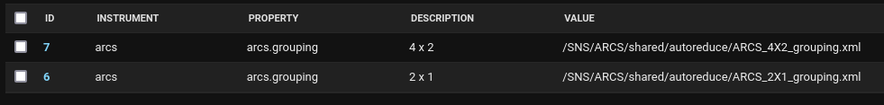
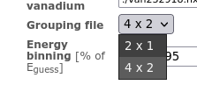
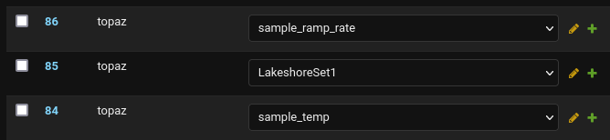
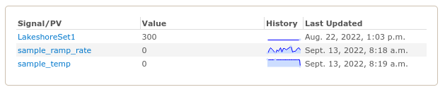

Admin settings
==============

This is a collection of settings stored in the database that are
manually edited through the Django admin dashboard found at
``/database`` sub-directory.

For the production deployment it can be found at
https://monitor.sns.gov/database You are required to be a `superuser`
to modify the settings, see :ref:`users`.

Active Instrument
#################

URL: https://monitor.sns.gov/database/dasmon/activeinstrument/

An instrument can be hidden from the Web Monitor by deselecting the
``Is Alive`` option in the model. This is useful to hide testing or
fake instruments.

Choice
######

URL: https://monitor.sns.gov/database/reduction/choice/

The ``Choice`` model controls selection options for instrument
reduction templates.

*e.g.* the ``arcs.grouping`` properties

corresponds to the ``Grouping File`` selection at
https://monitor.sns.gov/reduction/arcs/

Monitored Variables
###################

URL: https://monitor.sns.gov/database/pvmon/monitoredvariable/

The ``Monitored Variable`` model control which PVs appear on the
instrument status page. To promote a PV from the PV page to the status
page just create a model with the correct ``Instrument`` and ``PV
Name``. To remove a PV from the status page just delete that model.

For example, the following ``Monitored Variables`` exist for TOPAZ,

which results in the following PVs appearing on https://monitor.sns.gov/dasmon/topaz/

PV Name
#######

URL: https://monitor.sns.gov/database/pvmon/pvname/

A ``PV Name`` model is created whenever a new PV is received. By
default it will be visible on the instrument ``PVs`` page but if you
deselect the ``MONITORED`` on a particular ``PV Name`` it will no
longer be visible.

.. _users:

Users
#####

URL: https://monitor.sns.gov/database/auth/user/

This allows you to control who is staff or superuser. Being a
superuser gives you access to the admin settings while being staff
gives you access to the :ref:`admin-view`.
