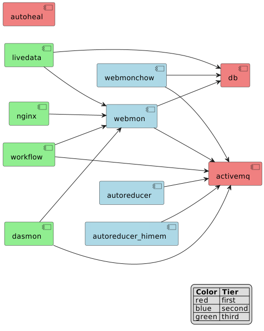

Developer documentation
=======================

Architecture
------------

.. toctree::
   :maxdepth: 1

   architecture/overview
   architecture/communication_flows

Developer Guide
---------------

.. toctree::
   :maxdepth: 1

   instruction/build
   instruction/test_fixture
   instruction/docker
   instruction/add_instrument
   instruction/autoreduction
   instruction/contribute
   instruction/manual_testing
   instruction/deployment

Modules
-------

The web-monitor contains three independent Django applications

    * :py:mod:`dasmon_listener`: to interface with the data acquisition system (DAS).
    * :py:mod:`webmon <reporting>`: user facing web interface, visit the production version at `monitor.sns.gov`_.
    * :py:mod:`workflow`: backend manager.

.. toctree::
   :maxdepth: 1

   dasmon/modules
   webmon/modules
   workflow/modules

.. _monitor.sns.gov: https://monitor.sns.gov/

Services
--------

The components making up the infrastructure of Web Monitor have dependencies.
In the diagram below shows the dependencies of the local deployment,
where service ``webmonchow`` depends on service ``db``.

Related software
----------------

* `post_processing_agent <https://github.com/neutrons/post_processing_agent/>`_ is the system that runs on the autoreducer nodes
* `live_data_server <https://github.com/neutrons/live_data_server>`_ is the system that contains database for holding the plots/divs produced by live reduction and autoreduction
* `livereduce <https://github.com/mantidproject/livereduce>`_ is the ``sysctl`` daemon that runs on instrument computers and generates plots of the active acquisition

Media
-----

Presentations and other media related to the project.

+------------------------------------------------------------+--------------------------------------------------------+
| .. image:: images/NDAV_training_ar_2016.png                |                                                        |
|    :width: 250px                                           | :download:`PDF <images/NDAV_training_ar_2016.pdf>`     |
|    :height: 125px                                          |                                                        |
|    :align: center                                          |                                                        |
|    :alt: workflow management and instrument web monitoring | :download:`PPTX <images/NDAV_training_ar_2016.pptx>`   |
+------------------------------------------------------------+--------------------------------------------------------+
| .. image:: images/backman_2024.png                         |                                                        |
|    :width: 250px                                           | :download:`PDF <images/backman_2024.pdf>`              |
|    :height: 125px                                          |                                                        |
|    :align: center                                          |                                                        |
|    :alt: webmon - overview and recent work                 | :download:`PPTX <images/backman_2024.pptx>`            |
+------------------------------------------------------------+--------------------------------------------------------+
| .. image:: images/doucet_overview.png                      |                                                        |
|    :width: 250px                                           | :download:`PDF <images/doucet_overview.pdf>`           |
|    :height: 125px                                          |                                                        |
|    :align: center                                          |                                                        |
|    :alt: web monitor - overview                            | :download:`PPTX <images/doucet_overview.pptx>`         |
+------------------------------------------------------------+--------------------------------------------------------+
| .. image:: images/AR-webmonitor.png                        |                                                        |
|    :width: 250px                                           | :download:`PDF <images/AR-webmonitor.pdf>`             |
|    :height: 125px                                          |                                                        |
|    :align: center                                          |                                                        |
|    :alt: web monitor - installation and maintenance        | :download:`PPTX <images/AR-webmonitor.pptx>`           |
+------------------------------------------------------------+--------------------------------------------------------+
| .. image:: images/AR-workflowmgr.png                       |                                                        |
|    :width: 250px                                           | :download:`PDF <images/AR-workflowmgr.pdf>`            |
|    :height: 125px                                          |                                                        |
|    :align: center                                          |                                                        |
|    :alt: workflow manager - installation and maintenance   | :download:`PPTX <images/AR-workflowmgr.pptx>`          |
+------------------------------------------------------------+--------------------------------------------------------+
| .. image:: images/AR-autoreducers.png                      |                                                        |
|    :width: 250px                                           | :download:`PDF <images/AR-autoreducers.pdf>`           |
|    :height: 125px                                          |                                                        |
|    :align: center                                          |                                                        |
|    :alt: Autoreduction service                             | :download:`PPTX <images/AR-autoreducers.pptx>`         |
+------------------------------------------------------------+--------------------------------------------------------+
| .. image:: images/AR-setup.png                             |                                                        |
|    :width: 250px                                           | :download:`PDF <images/AR-setup.pdf>`                  |
|    :height: 125px                                          |                                                        |
|    :align: center                                          |                                                        |
|    :alt: Autoreduction setup forms                         | :download:`PPTX <images/AR-setup.pptx>`                |
+------------------------------------------------------------+--------------------------------------------------------+
| .. image:: images/AR-IHC.png                               |                                                        |
|    :width: 250px                                           | :download:`PDF <images/AR-IHC.pdf>`                    |
|    :height: 125px                                          |                                                        |
|    :align: center                                          |                                                        |
|    :alt: When things go wrong                              | :download:`PPTX <images/AR-IHC.pptx>`                  |
+------------------------------------------------------------+--------------------------------------------------------+
