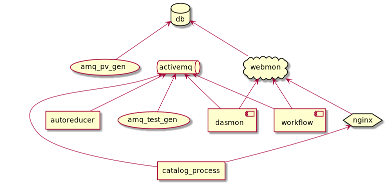

Developer documentation
=======================

Developer Guide
---------------

.. toctree::
   :maxdepth: 1

   instruction/build
   instruction/test_fixture
   instruction/docker
   instruction/contribute
   instruction/manual_testing

Modules
-------

The web-monitor contains three independent Django applications

    * :py:mod:`dasmon_listener`: to interface with the data acquisition system (DAS).
    * :py:mod:`webmon <reporting>`: user facing web interface, visit the production version at `monitor.sns.gov`_.
    * :py:mod:`workflow`: backend manager.

and a mocked catalog services.

.. toctree::
   :maxdepth: 1

   dasmon/modules
   webmon/modules
   workflow/modules
   catalog/modules

.. _monitor.sns.gov: https://monitor.sns.gov/

Services
--------

The components making up the infrastructure of Web Monitor have dependencies.
In the diagram below `service1` --> `service2` is to be read as `service1` depends on `service2`.
For instance, `amq_pv_gen` depends on `db`.

