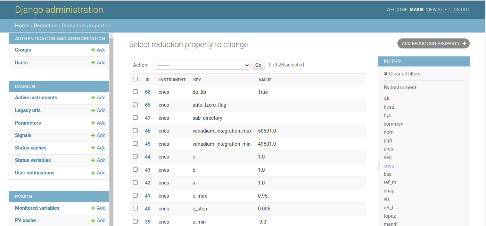

.. autoreduction-parameter-configuration

How to Modify an Instrument Autoreduction Configuration Page
============================================================

.. note::
    This document is a draft. If you use the instructions, please consider correcting/improving them.

Instrument scientists can set up a form where Web Monitor users with staff
status can modify the autoreduction script for the instrument.
The web form lets the instrument scientists change parameter values in the
autoreduction script and create a new version on the analysis cluster at

.. code-block:: shell

    /SNS/<instrument>/shared/autoreduce/reduce_<instrument>.py

from where it is fetched by the postprocessing agent during autoreduction.
`Here <https://monitor.sns.gov/reduction/cncs/>`_ is an example of the form for
the instrument CNCS (can only be viewed by logged in users with staff or
superuser status).

How to add a parameter to the configuration page
------------------------------------------------

The following describes how an instrument scientist can add new parameters to
an existing autoreduction configuration form.
The instrument CNCS will be used as an example.

1. When the instrument scientist submits new parameter values in Web Monitor,
a message containing a dictionary of key-value pairs is sent to the
`post-processing agent <https://github.com/neutrons/post_processing_agent>`_.
The post-processing agent replaces the template variables
(e.g. ``${motor_names}``) in ``reduce_<instrument>.py.template`` with values
from the dictionary and writes a new version of ``reduce_<instrument>.py``. To
add a new parameter, first add the template variable to the template script:

On the analysis cluster, modify the template Python script for the instrument

.. code-block:: shell

    /SNS/<instrument>/shared/autoreduce/reduce_<instrument>.py.template

to define the new templated variable and the logic using it, e.g.::

    Motor_names="${motor_names}"
    ...
    elog=ExperimentLog()
    elog.setSERotOptions(Motor_names)

2. Add an entry with instrument, a parameter key/name and default value to the
`reduction properties model in the database <https://monitor.sns.gov/database/reduction/reductionproperty>`_
using the Django administrative interface.

|

3. Make the parameter part of the configuration form by adding it as a field
(e.g. ``FloatField``) to the class ``ReductionConfigurationCNCSForm`` found in
`forms.py <https://github.com/neutrons/data_workflow/blob/next/src/webmon_app/reporting/reduction/forms.py>`_.

4. Make the parameter visible on the web page by adding the parameter and a
descriptive label to the HTML template used to display the form in
`configuration_cncs.html <https://github.com/neutrons/data_workflow/blob/next/src/webmon_app/reporting/templates/reduction/configuration_cncs.html>`_.

5. Create a pull request to `<https://github.com/neutrons/data_workflow/tree/next>`_.

6. When the change has been merged, a new release of Web Monitor should be
created in GitHub.
Once the release is available, work with the DevOps team to deploy the new
release into production, see the :doc:`deployment instructions <deployment>`.

How to test changes locally
---------------------------

Set up a local instance of Web Monitor by following the
:doc:`build instructions <build>`.

How to test in the test environment
-----------------------------------

TODO
