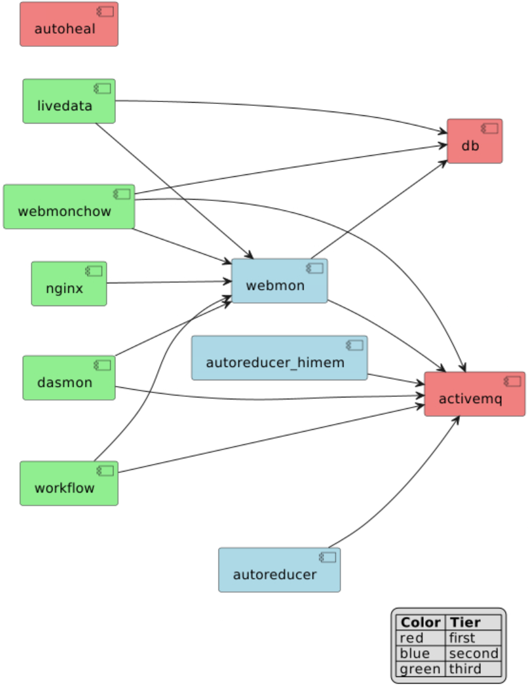

Developing in a Local Environment
=================================

.. toctree::
   :maxdepth: 2

.. note::
   This document is updated, however, it may be good to read the `continuous integration <https://github.com/neutrons/data_workflow/tree/next/.github/workflows>`_ scripts as well.

Dependencies between services
-----------------------------

The services making up the infrastructure of Web Monitor have dependencies.
The diagram below shows the dependencies for a local deployment guaranteeing that
the application will run _and_ that both unit and system tests will pass.

``service1`` --> ``service2`` is to be read as ``service1`` depends on ``service2``.
For instance, ``webmonchow`` depends on ``db``.

Description of available Django settings
----------------------------------------
Settings are split according to different target environments,
which can be roughly divided into *local* and *remote* environments.
A settings is selected by specifying variable ``DJANGO_SETTINGS_MODULE``

**Local Environments:**
    * ``reporting.reporting_app.settings.unittest`` for running outside of docker, in the conda environment
    * ``reporting.reporting_app.settings.develop`` for local docker containers.
      This can be connected to production ldap server in a read only mode and will ignore TLS errors.
    * ``reporting.reporting_app.settings.envtest`` for running system tests with docker images.

**Remote Environments:**
    * ``reporting.reporting_app.settings.prod`` for the testing and production environments deployed by
      the CI/CD pipeline of https://code.ornl.gov/sns-hfir-scse/deployments/web-monitor-deploy.

Running static analysis
-----------------------

This repository uses `pre-commit framework <https://pre-commit.com/>`_ to run the static analysis checks.
After installing pre-commit the checks can be run using

.. code-block:: shell

   pre-commit run --all-files

Running unit tests
------------------

The unit tests exist next to the code it is testing.
They are run inside a conda environment and pointing at the correct directory with the configuration inside the root-level ``setup.cfg``.
Replace ``conda`` with ``mamba`` for the faster dependency resolver.
This is based on what is run in `.github/workflow/ci.yml <https://github.com/neutrons/data_workflow/blob/next/.github/workflows/ci.yml>`_

.. code-block:: shell

   make create/conda  # substitute with "create/mamba" when using mamba
   conda activate webmon
   DJANGO_SETTINGS_MODULE=reporting.reporting_app.settings.unittest \
      python -m pytest src

If the environment already exists, ``conda_environment.yml`` can be used to update it as well.

.. code-block:: shell

   conda activate webmon
   conda env update --file conda_development.yml

Running system tests
--------------------

The system test are run via `.github/workflow/systemtests.yml <https://github.com/neutrons/data_workflow/blob/next/.github/workflows/systemtests.yml>`_ .

.. code-block:: shell

   make all # wheels and test data
   LDAP_SERVER_URI=. LDAP_DOMAIN_COMPONENT=. DJANGO_SETTINGS_MODULE=reporting.reporting_app.settings.envtest docker compose up --build

Wait for a time for everything to get up and running.
This is normally noted by seeing a collection of worker threads starting.
Once started tests can be run via

.. code-block:: shell

   LDAP_SERVER_URI=. LDAP_DOMAIN_COMPONENT=. DJANGO_SETTINGS_MODULE=reporting.reporting_app.settings.envtest python -m pytest tests

Building a local deployment
---------------------------

Most of the shell commands used when working in the developer setup (a.k.a "localdev")
are encapsulated in ``make`` targets. Type ``make help`` for a list of ``make`` targets
and a brief description.

When starting from scratch, open a shell where the following secret environment variables have
been initialized:

.. code-block:: shell

   DJANGO_SETTINGS_MODULE=reporting.reporting_app.settings.develop
   GENERAL_USER_USERNAME=GeneralUser
   GENERAL_USER_PASSWORD=GeneralUser
   LDAP_SERVER_URI=*****
   LDAP_USER_DN_TEMPLATE=*****
   LDAP_DOMAIN_COMPONENT=*****
   CATALOG_URL=*****
   CATALOG_API_TOKEN=*****

It is recommended to store these variables in an ``.envrc`` file and manage their loading/unloading
into the shell with the `direnv <direnv/>`_ command-line utility.

Secret Variables
++++++++++++++++
The environment variables ``LDAP_SERVER_URI`` and ``LDAP_DOMAIN_COMPONENT`` are shown above with no-op values.
Senior developers can provide the values to use,
then the developer setup can work with Neutron Scattering Division's (NSD) LDAP instance.

The environment variables ``CATALOG_URL`` and ``CATALOG_API_TOKEN``
can be set to allow run metadata to be retrieved
from `ONCat <https://oncat.ornl.gov>`_.

Special users
+++++++++++++
While one can connect to the production LDAP, in a developer environment there are listed below as username:password

* ``GeneralUser`` : ``GeneralUser`` has permissions to pages similar to a general beamline users.
  The username and password can be set using the ``GENERAL_USER_USERNAME`` and ``GENERAL_USER_PASSWORD`` environment variables.
  The credentials are stored in ``unittest.py`` settings file
* ``InstrumentScientist`` : ``InstrumentScientist`` has permissions similar to an instrument scientist

After setting the environment variables, run the following ``make`` targets in the shell:

.. code-block:: shell

   make create/conda # or "make create/mamba" for mamba, to create the webmon conda environment
   make all  # create: python packages for dasmon, webmon, and workflow; fake SNS data; self-signed SSL certificates
   make localdev/up  # build all the services

The site is served at http://localhost by default.

Porting changes in the source code to the local deployment
++++++++++++++++++++++++++++++++++++++++++++++++++++++++++
The apps are actually served in the local deployment from python wheels.
Thus, after changing the source code of the apps,
it is necessary to rebuild the python wheels and restart the services.

1. stop the running containers
2. recreate the python wheel(s) if the source code of the apps has changed
3. rebuild the services

Stop the running containers
~~~~~~~~~~~~~~~~~~~~~~~~~~~
Stoping and deleting the running containers as well as deleting the images and docker volumes:

.. code-block:: shell

   docker compose down --volumes

this command will delete the database. Omit ``--volumes`` if preservation of the database is desired.

Alternatively, do **Ctrl-C** in the terminal where  you ran ``make localdev/up`` or ``docker compose up --build``.

Recreate the Python wheels
~~~~~~~~~~~~~~~~~~~~~~~~~~
The selected format to inject ``dasmon``, ``webmon``, and ``workflow`` apps into their
corresponding services is python wheels, thus any changes for the python
source code requires rebuilding the python wheel(s).

For instance, if the source code of ``dasmon`` is changed, run at this
point ``make wheel/dasmon`` to rebuild the ``dasmon`` wheel.

If necessary, delete all existing wheels with ``make wheel/clean``, then run ``make all`` to recreate them.

Rebuild the services
~~~~~~~~~~~~~~~~~~~~
Run again ``make localdev/up``. This ``make`` target builds the services
with command ``docker compose up --build`` using settings in ``docker-compose.yml``.

More information on docker commands for this project can be found :doc:`here <docker>`.

Uploading a database dump
+++++++++++++++++++++++++

Make target ``localdev/dbup`` contains the shell command to load the
database dump and start the service. Assuming that:

- we started the ``webmon`` Conda environment
- the full path to the dump file  is ``./database_dump_file.sql``:
- the current working directory is the root of the source tree (containing file ``.env``):

.. code-block::

   (webmon) $> dbdumpfile=./database_dump_file.sql make DATABASE_PASS=$(dotenv get DATABASE_PASS) localdev/dbup

Target ``localdev/dbup`` sets ``LOAD_INITIAL_DATA="false"``, thus preventing loading the default
database dump (file "db_init.json")
