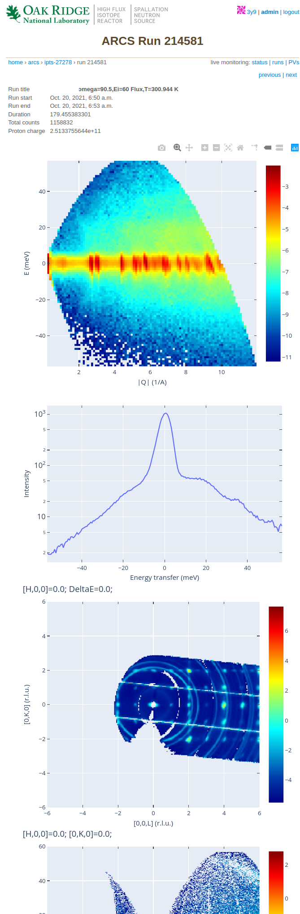

General User View
=================

.. toctree::
   :maxdepth: 2

In addition to the :doc:`Guest_user`, there are additional privileges
for which the user must be logged in. To to that, click on the `login`
link at the top right of the page.

As opposed to a guest user, when clicking on a specific run, a logged in user will get
more information, and plots (if set up that way by the instrument scientist/CIS).

At the bottom of the page there is a table describing the processing status of the
particular data file. 

For example, runs that are actively collecting data will display a status of
*“Acquiring”*. Once acquisition finishes, the run may move to a *“Processing”*
status, and finally show *“Complete”* once processing is done.

Any error messages will show up in red. Please communicate with your local
contact about any such occurrences.

.. image:: images/example_data_table.png
   :width: 100%
   :align: center
   :alt: data table view example for general user
