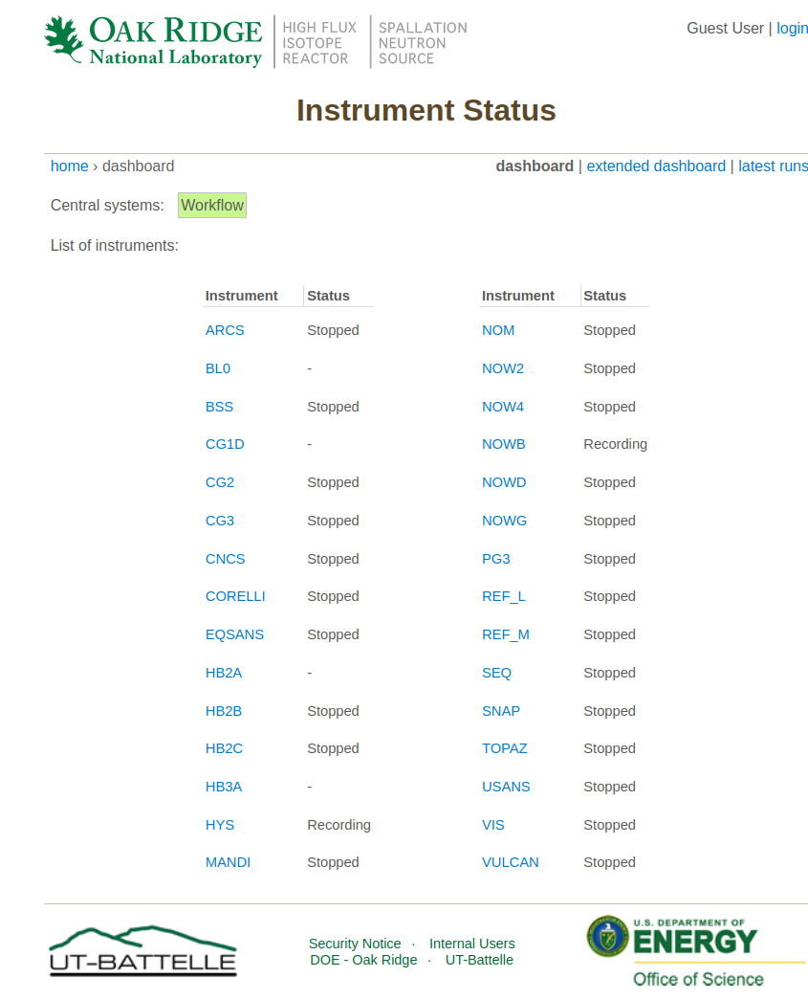
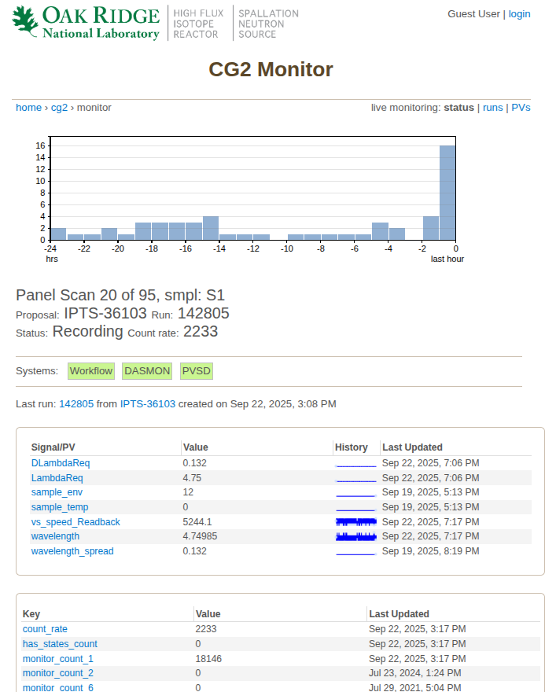
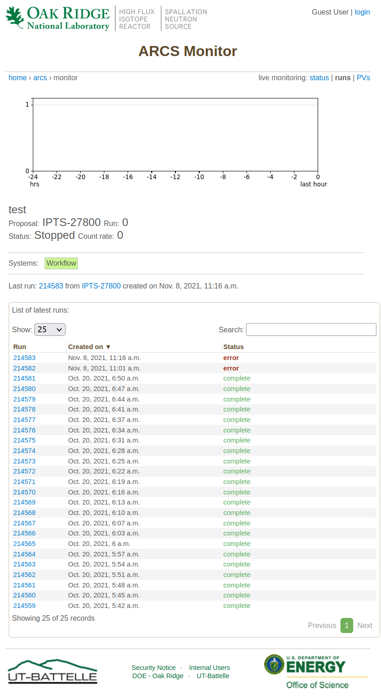
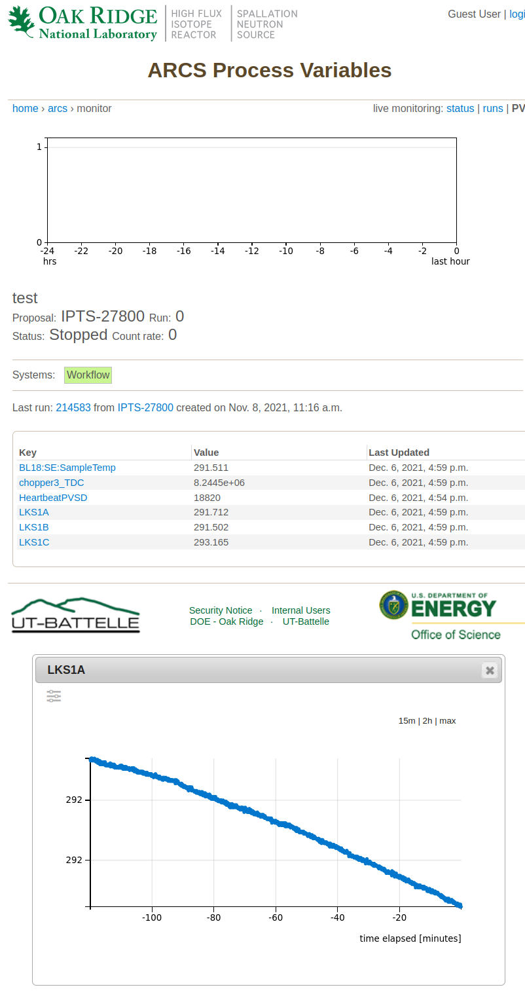
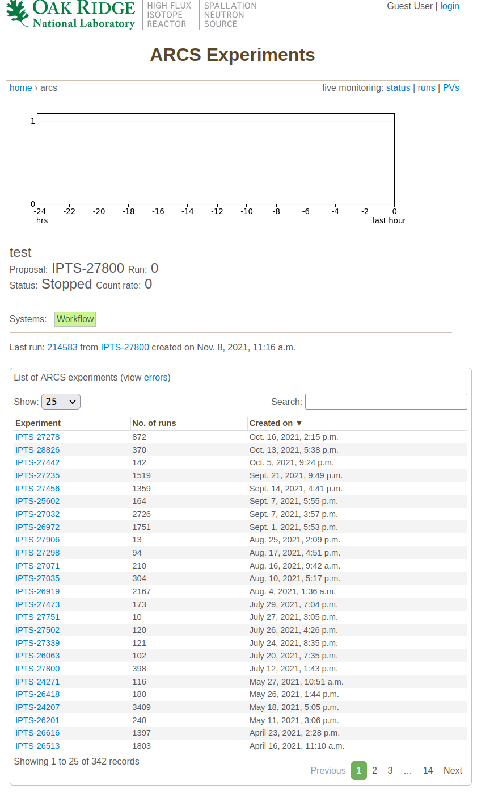
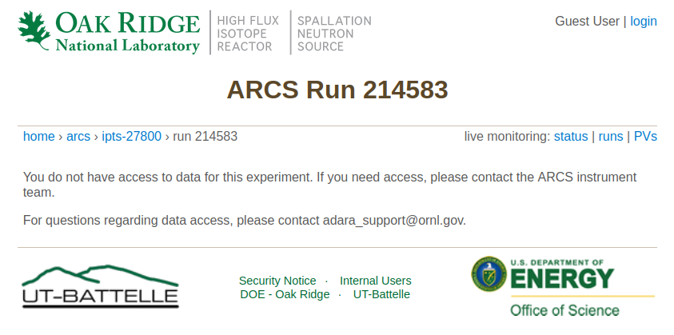

Guest User View
===============

.. toctree::
   :maxdepth: 2

Anyone can see a list of instruments

When clicking on any instrument one can see the status of the instrument

In the top right hand side, there are links to see the runs in the current
experiment, together with the processing status.

For example, runs that are actively collecting data will display a status of
*“Acquiring”*. Once acquisition finishes, the run may move to a *“Processing”*
status, and finally show *“Complete”* once processing is done.

In addition, there is a list of process variables (PVs). These are a list of sample
environment and instrument parameter logs.
If one clicks on a PV link, it will show the history of that PV in the last 15 minutes or 2 hours.
The ``y`` scale can be switched between linear and logarithmic.

Clicking on the instrument name in the breadcrumbs will display a list of `IPTS <https://ipts.ornl.gov>`_ experiments

Note that guest users don't have access to the data, so clicking on any run will prompt the user to log in with
their `UCAMS/XCAMS <https://user.ornl.gov/Account/Login>`_ credentials

