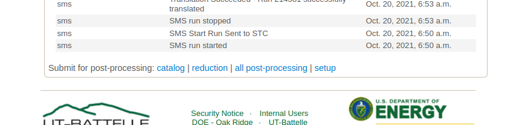
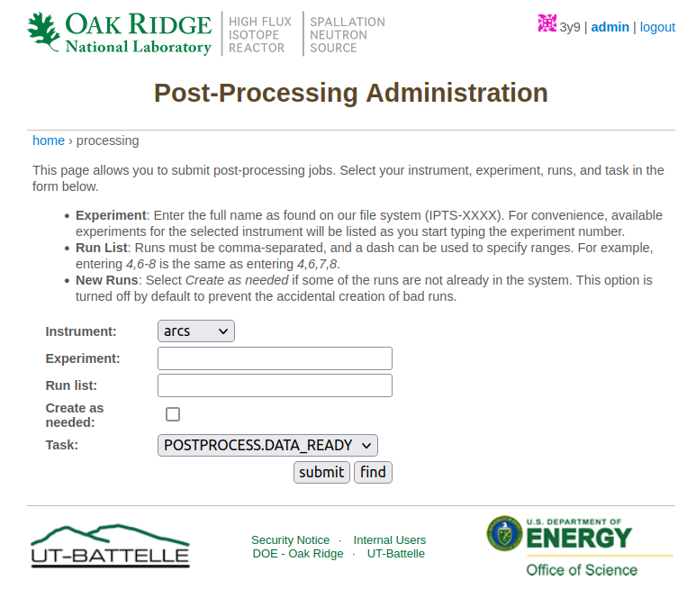

Instrument Scientist View
=========================

.. toctree::
   :maxdepth: 2

The instrument scientist (local contact) can send individual runs back for cataloging, or reduction, by clicking
on the links at the bottom of the page.

In addition, several beamlines can open a setup page for auto-reduction (click on ``setup``).

.. image:: images/example_ARCS_auto_reduction.png
   :width: 100%
   :align: center
   :alt: ARCS auto-reduction example

The exact view is instrument specific.
Modifying the configuration page will generate a new auto-reduction script.
There is a ``reduction_INSTRUMENT.py`` template file.
In several places in the file the variables on this page are inserted, and the file is saved as ``/SNS/INSTRUMENT/shared/autoreduce/reduce_INSTRUMENT.py``.

For example, in the case of ARCS, ``RawVanadium="${raw_vanadium}"`` is changed to ``RawVanadium="/SNS/ARCS/IPTS-27800/nexus/ARCS_201562.nxs.h5"``.
A special case is for mask, where ``${mask}`` is changed to

    * ``MaskBTPParameters.append({'Pixel': '1-7,122-128'})``
    * ``MaskBTPParameters.append({'Pixel': '1-12,117-128', 'Bank': '70'})``
    * ``MaskBTPParameters.append({'Pixel': '1-14,115-128', 'Bank': '71'})``

The current settings on the configuration page are stored in a database.
Changing them and clicking submit should yield a message at the bottom of the page that contains the change time.

.. _admin-view:

Admin View
----------

Certain people can run a batch postprocessing.
On top, next to the username, click on ``admin``.
It will open a page like below

One can then submit several runs for re-reduction.
This is useful if there is a mistake in the reduction script.
The messages for postprocessing are not necessarily handled in the order of run numbers.

.. note::
   Most instrument scientists do not have this option.
