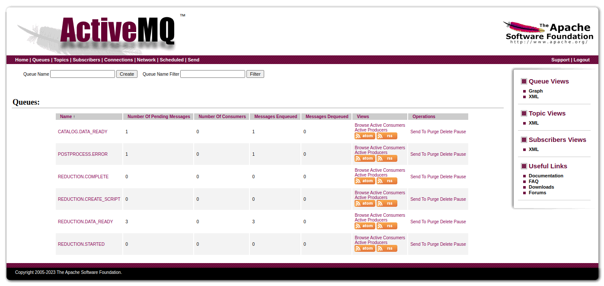

=======================
ActiveMQ message broker
=======================

ActiveMQ Classic comes with a web console that can be used for monitoring queues, subscribers,
etc. At the moment users/developers need to work with Linux sysadmins to access the ActiveMQ web
console at https://amqbroker.sns.gov:8161/, but this will be addressed as part of the migration to
ActiveMQ Artemis.

