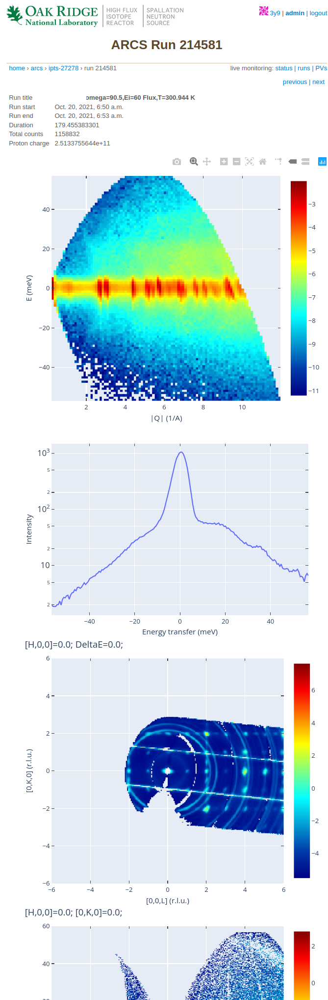

General User View
=================

.. toctree::
   :maxdepth: 2

I have the same privileges as a guest without login.
In addition, when I click on a specific run, I get information and plots (if set up that way by the instrument scientist/CIS)

At the bottom of the page there is a table describing what has been done for the data

.. image:: images/example_data_table.png
   :width: 100%
   :align: center
   :alt: data table view example for general user
