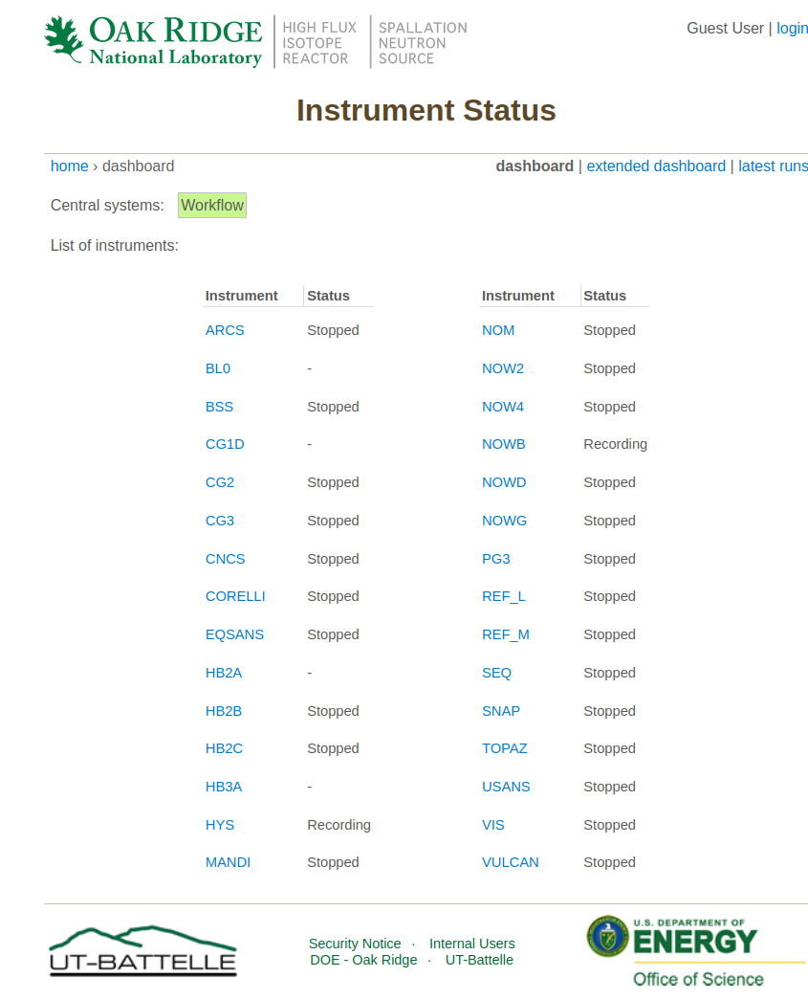
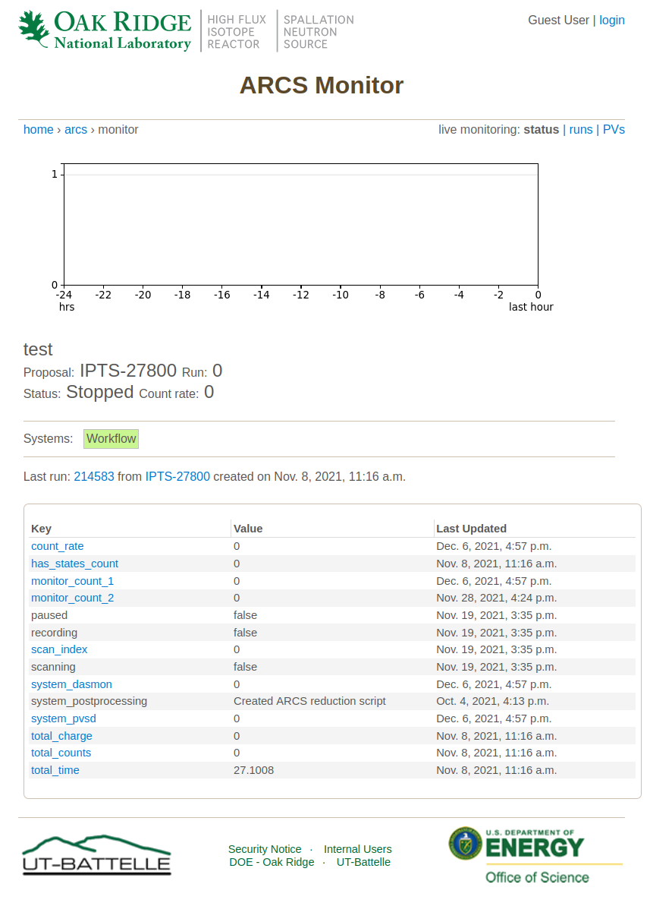
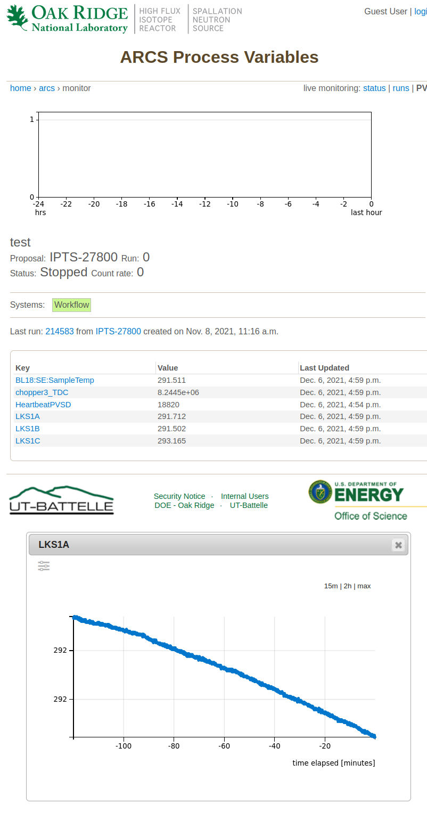
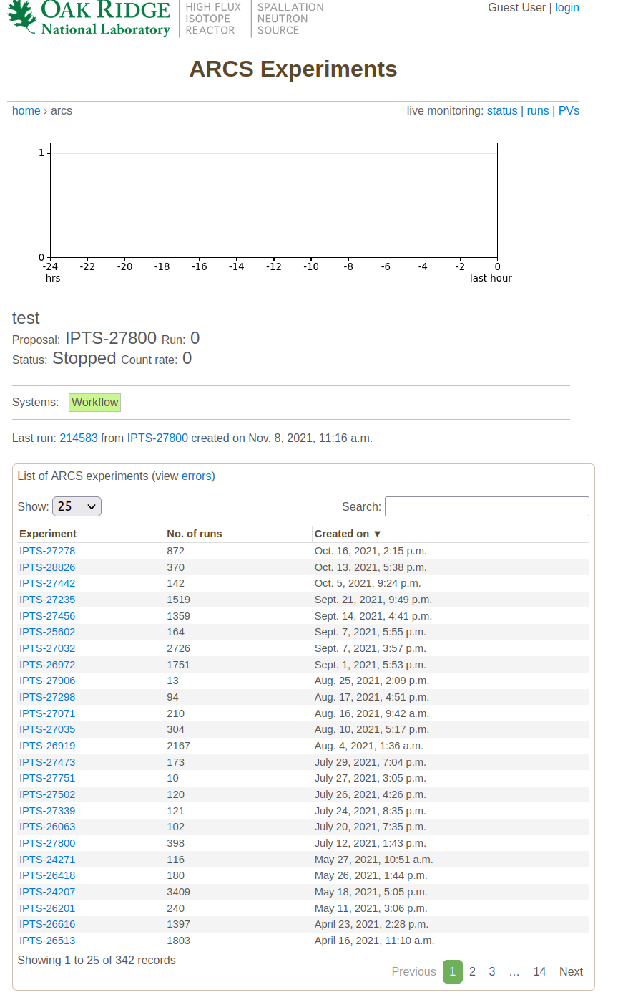
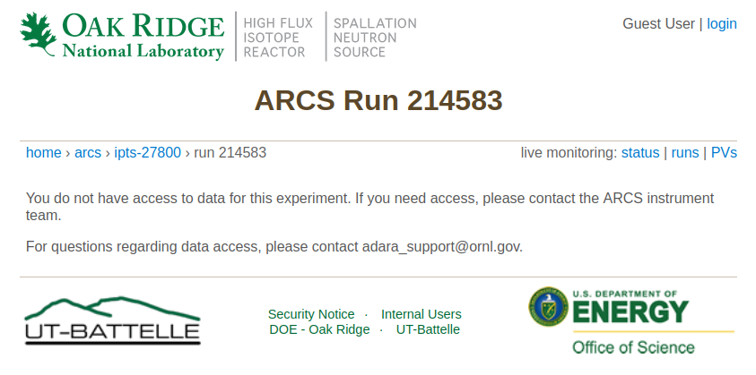

Guest User View
===============

As a guest user I can see a list of instruments

When clicking on any instrument I can see the status of the instrument

I can see a list of runs for that instrument, or a list of PVs

.. image:: images/example_run_list.png
   :width: 100%
   :align: center
   :alt: example view of run list viewed as guest user

If I click on a PV it will show the history of that PV in the last 15 minutes or 2 hours.
I can change the ``y`` scale to be logarithmic.

If I click on the instrument name in the breadcrumbs, it will display a list of IPTS experiments

Once I click on a run, I should get a message that I don't have access to the data

