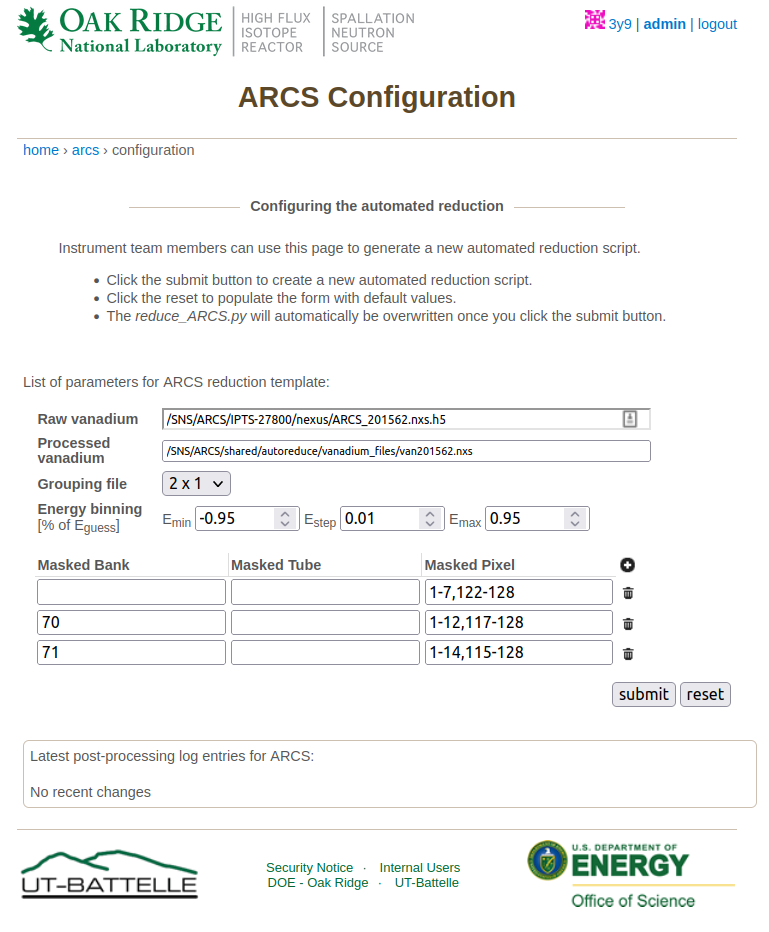
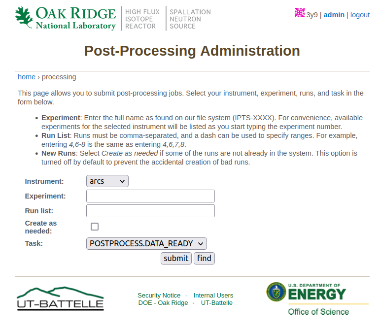

# Instrument scientist view

At the bottom of the process table, the instrument scientist can send the data back for catalogging, or reduction.

In addition several beamlines can open a setup page for autoreduction (click on **setup**).

The exact view is instrument specific. Modifying the configuration page will generate a new autoreduction script. There is a reduction_INSTRUMENT.py.template file. In several places in the file the variables on this page are inserted, and the file is saved as `/SNS/INSTRUMENT/shared/autoreduce/reduce_INSTRUMENT.py`. For example, in the case of ARCS

`RawVanadium="${raw_vanadium}"`

is changed to

`RawVanadium="/SNS/ARCS/IPTS-27800/nexus/ARCS_201562.nxs.h5"`

A special case is for mask, where `${mask}` is changed to

`    MaskBTPParameters.append({'Pixel': '1-7,122-128'})`

`    MaskBTPParameters.append({'Pixel': '1-12,117-128', 'Bank': '70'})`

`    MaskBTPParameters.append({'Pixel': '1-14,115-128', 'Bank': '71'})`

The current settings on the configuration page are stored in a database. Changing them and clicking submit should yield a message at the bottom of the page that contains the change time.

# Admin view

Certain people can run a batch postprocessing. On top, next to the username, click on **admin**. It will open a page like below

One can then submit several runs for re-reduction. This is useful if there is a mistake in the reduction script. The messages for postprocessing are not necessarily handled in the order of run numbers. Most instrument scientists do not have this option.
